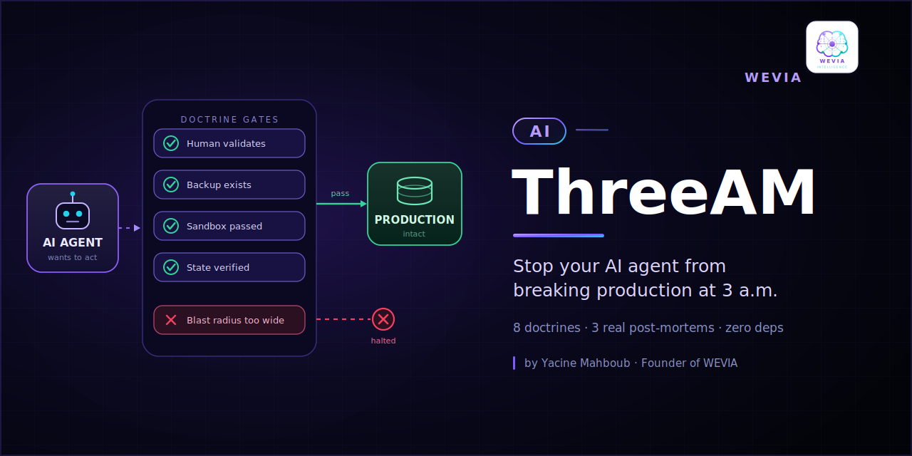

<h1 align="center">AI AgenticSafe</h1>

<b>Stop your AI agent from breaking production at 3 a.m.</b>

8 battle-tested doctrines &nbsp;·&nbsp; 3 real post-mortems &nbsp;·&nbsp; zero dependencies

---

## Why

Every agent framework tells you how to make an agent *act*. Almost none tell you how to stop it from quietly destroying something while you sleep.

These are not principles someone brainstormed. Each one was written the expensive way — after something broke in production, and we wrote down the rule that would have prevented it.

Created by **Yacine Mahboub**, Founder of WEVIA.

## The 8 doctrines

| # | Doctrine | The rule |
|---|---|---|
| 0 | **Separation of powers** | The human validates. The agent executes. Never the same actor. |
| 1 | **Backup before mutation** | No modification without a restorable copy made first. |
| 2 | **Zero regression** | A change that breaks a passing test is an incident, not a change. |
| 3 | **Honesty over fluency** | Absent is absent. Never fabricate a result to keep the output tidy. |
| 4 | **Sandbox before production** | Nothing ships that wasn't validated in an isolated copy. |
| 5 | **Verify, don't assume** | Exit code 0 is not proof the intent was achieved. Read back the state. |
| 6 | **Bounded blast radius** | Mass operations forbidden by default. Small batches, each verified. |
| 7 | **Repair, never delete** | Deleting an application is not a repair. |

Full text with rationale and failure modes → **[DOCTRINES.md](DOCTRINES.md)**

## Drop it into your agent

Copy [`templates/operator-system-prompt.md`](templates/operator-system-prompt.md) into your system prompt. One file, no runtime, works with any model or framework.

## The post-mortems

Each doctrine exists because something broke. The anonymized write-ups are in **[lessons/](lessons/)**:

- **[Deleting a public fork does not remove your secrets](lessons/01-deleting-a-public-fork-does-not-remove-your-secrets.md)** — a credential stayed publicly readable *after* the repository was deleted. Most people don't know this is possible.
- **[The filter that restarted cleanly and threw everything away](lessons/02-the-filter-that-silently-discarded-everything.md)** — a config that validated, restarted green, and silently discarded every message it was meant to route.
- **[The service was never broken, the check was](lessons/03-the-service-was-never-broken.md)** — two months of `unhealthy` on a perfectly healthy service, one restart away from a real outage.

## Governance

Rules nobody owns are suggestions. Who writes them, who approves them, and what happens when one is violated → **[GOVERNANCE.md](GOVERNANCE.md)**

## Related

**[AI Quorum](https://github.com/Yacineutt/AI-Quorum)** — one prompt, every model, measured agreement. Doctrine 3 in executable form.

## License

Apache-2.0. Copy them, adapt them, argue with them.

---

Maintained by <a href="https://weval-consulting.com">WEVIA</a> — sovereign AI platform engineering.

